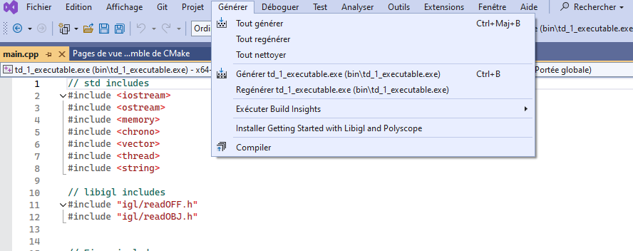
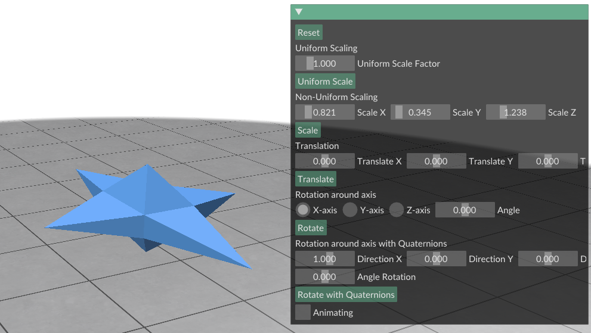
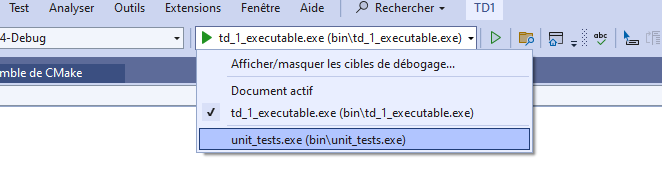
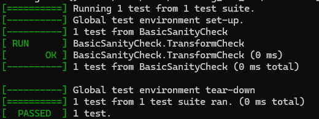
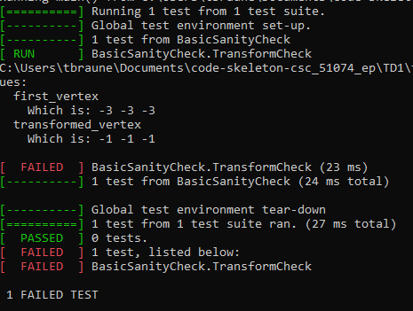

# TD1 -- Getting Started and Linear Transformations

How to create a simple editor and viewer for 3D shapes? The goal of this TD is to provide a very quick overview of some features of the Libigl and Polyscope library.
(The students who did not follow any course on C++, are encouraged to read [this](https://imagecomputing.net/cgp/compilation/content/01_compilation/index.html) page which describes in details the process to follow in order to set-up the system to compile C++ code, as well as [INF443 notes](https://imagecomputing.net/damien.rohmer/teaching/inf443/practice/content/02_c++_opengl/index.html) on C++ basic notions.). 


To get started, you can open this folder ``TD1``. If you use Linux or Mac you will need to type
```shell
mkdir build
cd build
cmake ..
make -j8
./bin/td_1_executable
```

If you do that, a default mesh will be loaded. If you want to specify a special mesh, you can --once compiled-- type
```shell
./bin/td_1_executable ../data/your-favorite-mesh.off
```

If you are using Windows and Visual Studio, assuming you installed cmake properly, once you open the folder ``TD1`` the ``CMakeLists.txt`` should be recognized. Once the CMake generation is done, you can compile the code through clicking on ``Tout generer``
||
|:----:|

As for Linux, once the code is compiled you can run the executable. You can either do that through clicking on the executable in the top bar or via the windows terminal. Then you can also load a custum mesh into your program. To do that you need to open the folder of this TD in a PowerShell and change through the following in the folder that contains the executable:
```PowerShell
cd .\out\build\x64-Debug\bin\
```
Now, you can run the executable via
```PowerShell
.\td_1_executable.exe ..\..\..\..\data\your_favorite_mesh.off
```
You notice that the path for Linux and Windows is different. 

We load the mesh with the method ```igl::readOFF(filename, V, F);``` in our program. Now, the information of the mesh will be loaded into the matrices ```V``` and ```F```. For linear algebra we will use the library ```Eigen``` that comes for us with ```Libigl```. The matrix ```Eigen::MatrixXd V``` has three columns and stores for each row the $\mathbb{R}^3$ point positions for the mesh. The matrix ```Eigen::MatrixXd``` contains integers and the connectivity information about the mesh.

Today you will only need to manipulate the matrix ```V```.


### Visualization with Polyscope

Now, that we have loaded the mesh in our program, we also want to visualize it and do interesting things with it. To do that we will make use of the polyscope library. Whenever we want to visualize a mesh with polyscope, we first need to create a pointer in the ```main.cpp``` to a polyscope mesh.
```bash
polyscope::SurfaceMesh* psMesh;
``` 

Subsequently we can pass the matrices ```V,F``` to the viewer and run
```bash
// Initialize polyscope
polyscope::init();

psMesh = polyscope::registerSurfaceMesh("Input Mesh", V, F);

polyscope::state::userCallback = callback;

polyscope::show();
```

This will be the basic workflow for all the TP's that you are gonna work on in this course. By adding the callback function, this function is going to be called each frame. Thus, if you manipulate something on your geometry --what you are gonna do now--, you need to tell polyscope in there that the ```psMesh`` should be changed. For now, this callback method might look scary, but don't worry. For now you have to tough there nothing.

### Linear Mesh Transformations

You have seen in this weeks lecture how linear mesh transformations, like scaling, translation or rotation with quaternions can be realized through homogeneous coordinates.

To implement them in practice you can complete the methods that are provided to you in the class ```Transform```.

The class ```Transform``` contains a $4\times 4$ matrix ```Eigen::MatrixXd M``` that represents the matrix that acts on the homogeneous coordinates of the object that we want to transform.

For example once you set the uniform scaling parameters for each axis, the result might look like the following
||
|:----:|

You can also interactively modify the star when you check the Animating checkbox and you implement the method ```rotate_with_quaternions```

<video src="../imgs/moving_star.mp4" width="991" height="551" controls></video>


## Unit testing of your code

In order to give you some kind of check whether everything went well with your implementation, we are going to do unit tests with the code. We will realize them with the library [googletest](https://google.github.io/googletest/primer.html).

We provide you with a file ```unittests.cpp``` in the folder tests that contains some test cases for your code that either we give to you, you write for yourself, or will be a task for you to be written.

We generated the ```CMakelists.txt``` for you such that as soon as you compile your project, a second executable called ```unit_tests``` is build. 
You can then run the unittests through 
```bash
./bin/unit_tests
```

In windows you can just select a different executable
||
|:----:|

Each test starts with the ```TEST(TestSuiteName, TestName)```. You can for example name the suite ```TransformTest``` and define different tests for the scaling, rotation, etc. 

Then you will start to do some assertions. Here, in the sample test, we want to test for instance, whether everything went well to chain the methods for the uniform scaling together. Thus, we scale a vertex by hand, and compare how the class scales the vertex.
```bash
TEST(TransformCheck, BasicSanityCheck) {
#ifdef USING_GNU
    int i0 = igl::readOFF("../data/star.off", V0, F0);
    // Load GNU-specific meshes
#elif defined(USING_MSVC)
    int i0 = igl::readOFF("../../../../data/star.off", V0, F0);
    // Load MSVC-specific meshes
#else
    int i0 = igl::readOFF("../data/star.off", V0, F0);
    // Load default meshes
#endif
    MatrixXd first_vertex = V0.row(0);
    MatrixXd scaled_vertex = 3 * first_vertex;
    Transform T;
    T.uniform_scale(3.0);
    T.apply_transform(V0);
    MatrixXd transformed_vertex = V0.row(0);
    ASSERT_EQ(scaled_vertex, transformed_vertex);
}
``` 
When the executable runs, it will check the assertions in the code and will tell us if we pass the test or not.
||
|:----:|

||
|:----:|

