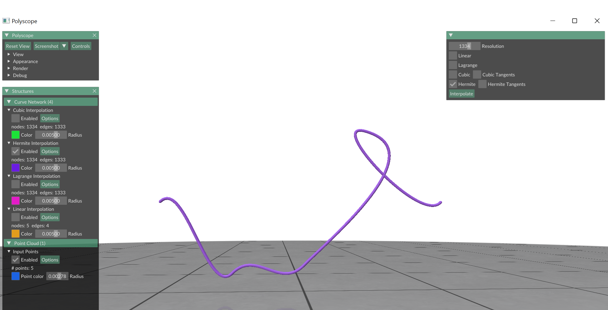

# TD 2 - A basic editor for curve interpolation

Examples of curve interpolation schemes (Lagrange and cubic spline interpolations)

## 0. Drawing curves

We will use Polyscope to visualize curves, which will be generated using various interpolation techniques that you will implement, applied to a given point set. Please note the following paths for data files based on your development environment:

    Visual Studio Compilation: The data file is located at "../../../../data/curve0.ply".
    Linux, Mac, or Windows Terminal: The data file is located at "../data/curve0.ply".


The Interface: once each interpolation method is implemented, it will be accessible via the "Interpolate" botton.

About the interface: In case you observe a shift between the points and the resulting interpolating curves, please reset the display as follows: choose the corresponding Options menu and reset it. Please note that you have the possibility to change the points and arrows' size (in case of tangent computation) to make them visible.   

## 1. Linear interpolation

Complete class `LinearInterpolation` implementing method `eval_function(float t)` which computes the value of the interpolation at time t. This function should be valid for t in  $[x_0,\ldots, x_{n-1}]$ where $x_0,\ldots,x_{n-1}$ are the points to be interpolated.


Example: linear interpolation of 5 points: $(x_0,y_0),\ldots,(x_4,y_4)$

## 2. Function interpolation

### 2.1 Lagrange interpolation: solve linear system of equations

Given a set of `n` points to interpolate, you have to solve a system of `n` equations (with `n` variables), represented in matrix form (as illustrated during the Lecture), as follows:
$$
\begin{pmatrix}
1& x_0& x_0^2&\cdots& x_0^{N-1}\\ 
1& x_1& x_1^2&\cdots& x_1^{N-1}\\
\vdots&\vdots&\vdots& &\vdots\\
1& x_{N-1}& x_{N-1}^2&\cdots& x_{N-1}^{N-1}
\end{pmatrix}\cdot\begin{pmatrix}a_0\\ a_1\\ \vdots \\ a_{N-1}\end{pmatrix} = 
\begin{pmatrix}
\Sigma_{k=0}^{N-1} a_k x_0^k\\
\Sigma_{k=0}^{N-1} a_k x_1^k\\
\vdots\\
\Sigma_{k=0}^{N-1} a_k x_{N-1}^k
\end{pmatrix}
$$

Complete the class `LagrangeInterpolation` by implementing the method `eval_function(float t)` and `Vandermonde(const MatrixXd &V, MatrixXd &W)` which computes Lagrange interpolation.


Example: Lagrange interpolation of 5 points $(x_0,y_0),\ldots,(x_4,y_4).$

The goal is to compute the coefficients of the polynomial expression for $f(x)$, by solving a linear system of equations.

The sequence of images below illustrates some drawbacks of Lagrange interpolation:


Example: Lagrange interpolation of 5 points: $(x_0,y_0),\ldots,(x_4,y_4)$
### 2.2 Cubic spline interpolation: matrix form

Given a set of $n$ points to interpolate, you have to solve a system of $4(n-1)$ equations (with $4(n-1)$ variables), represented in matrix form as below.

Complete class `CubicInterpolation` implementing the cubic spline interpolation.


Example: cubic spline interpolation: $(x_0,y_0),(x_1,y_1),(x_2,y_2),(x_3,y_3),(x_4,y_4)$. 

Suppose we are given $N+1$ points $(x_0,y_0),\ldots,(x_N,y_N)$ and the $i-$th polynomial segment is described through $f_i(x) = a_i + b_i x + c_i x^2 + d_i x^3$. Then with the given positions of the points, the given derivative values at the start and end and the fact that the derivative of the polynomials at the interior points should coincide, you can build a linear system to solve for the coefficients of the polynomials through:
$$
A\cdot \begin{pmatrix}a_0\\b_0\\c_0\\d_0\\ \vdots \\a_{N-1}\\b_{N-1}\\c_{N-1}\\d_{N-1}\end{pmatrix} = b.
$$

Solving this linear system will allow you to complete the function `eval_function(float t)` in the class `CubicInterpolation`.

### 2.3 Drawing tangents

Complete the function `eval_tangent()` of the class `CubicInterpolation` in order to draw the tangent vectors (at interpolated points).


## 3. Curve interpolation

### 3.1 Hermite cubic spline interpolation

Now, let us suppose we are given:
- a set of $n$ points to interpolate (added by the user in the frame),
- a set of $n$ vectors $\{t_i\}$, where $t_i$ is tangent to the curve at point $p_i = (x_i,y_i).$

**Remark:** for the sake of simplicity, the slopes (the $n$ vectors $\{t_i\}$) are provided as predefined parameters in the code (they are constant).

**Goals and Constraints:** we want to find a cubic parametric curve $f(t)=(x(t), y(t))$, such that:
- $f$ interpolates points, i.e $p_i=(x_i,y_i)$,
- $f$ respects $\mathcal{C}^1$ constraints (given by the tangents),
- Complete class `HermiteInterpolation` implementing the Hermite cubic spline interpolation.

**Suggestion:** As before, we suggest solving the problem in its matrix form, recalling that you should use the curve parametrization:
$$
f(t) = (x(t),y(t)).
$$
The $x-$component and the $y-$component are to be treated as polynomials themselves. As in the prior case of the spline interpolation:
$$
x(t) = a_x + b_x t + c_x t^2 + d_x t^3,\quad y(t) = a_y + b_y t + c_y t^2 + d_y t^3.
$$
Since the slopes at each point are given in this case, the linear system for the individual curves will not be coupled. It suffices to solve systems of the form:
$$
W_x\cdot \begin{pmatrix}a_x\\b_x\\c_x\\d_x\end{pmatrix} = \begin{pmatrix}x(0)\\ x(1)\\ x-\text{coordinate of the slope at }p_0\\x-\text{coordinate of the slope at }p_1\end{pmatrix}.
$$
In the same manner, a linear system for the coefficients of $y(t)$ can be solved. This allows you to complete the functions `solve_x` and `solve_y` in the class `HermiteInterpolation`.


Example: Hermite cubic spline interpolation of `5` points: $(x_0,y_0),\ldots,(x_4,y_4)$. The goal is to compute parametric expressions for $f_0,f_1$.

### 3.2 Drawing tangents

Modify the class `HermiteInterpolation` in order to draw the tangent vectors (at interpolated points).
```

