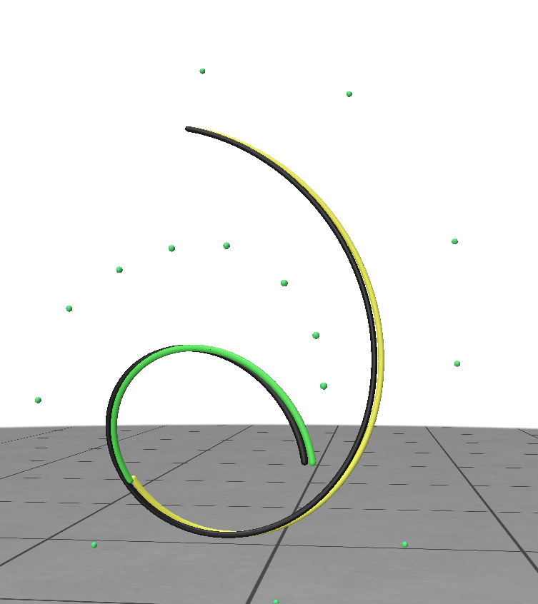

# TD 3 - Modeling 3D Shapes with Bézier Curves

## How to Model Simple 3D Shapes?

The goal of this TD is to provide a quick overview of Bézier curves.


### 1) Rendering Bézier Curves

Today, you will complete the file `Bézier.cpp`. The file `main.cpp` provides functions for reading input data and performing tests.

---

For the first basic task, we want to compute a Bézier curve. By *computing*, we mean evaluating the curve `B(t)` for a given parameter `t` in `[0..1]`. We suggest implementing the iterative version of the *de Casteljau* algorithm, though other methods are also valid.

**Remark**: A Bézier curve is represented by its control polygon (the input to your program), stored in a `MatrixXd` with `n` rows and 3 columns (since we are working in 3D).

The Interface

Complete the function `de_casteljau(...)`:

```cpp
MatrixXd de_casteljau(const MatrixXd &V, double t)
{
  int nV = V.rows();         // Number of points in the control polygon
}
```

This function should return a `MatrixXd` with 1 row representing the 3D point `B(t)`.

Next, you need a function for rendering the Bézier curve. A basic approach is to compute a uniform sampling of the curve and use a polyline to render it.

Complete the function `plot_curve(...)`:

```cpp
MatrixXd plot_curve(const MatrixXd &V, int k)
{
  // TODO
}
```

This function should return a `MatrixXd` with `k` rows, each representing a 3D point on the Bézier curve.

The `test1()` function in `main.cpp` renders a Bézier curve. If you are using Mac or Linux, run the following command to test it (your program requires the name of a `.ply` file containing a 3D point cloud):

```bash
INF574/TD/TD3/build$ ./bin/td_3_executable ../data/cubic.ply
```

Result of Task 1

---

### 2) Visualizing de Casteljau's Algorithm

In the lecture and in Task 1, you learned that de Casteljau's algorithm recursively calculates the value of a Bézier curve. Complete the function `test2` to create the intermediate polygons that visualize the recursive steps of de Casteljau's Algorithm. Attach these polygons to the `curve_renderer`, which is passed by reference to the function. Read and understand the methods in the `Util` class to accomplish this.

Create an animation (e.g., a `.gif`) to demonstrate the recursion in de Casteljau's algorithm.

---

Result of Task 2

### 3) Splitting a Bézier Curve

Subdivision is a crucial operation for Bézier curves, allowing us to split the curve or perform efficient rendering using recursive subdivision.

Complete the function `subdivide(...)`:

```cpp
vector<MatrixXd> subdivide(const MatrixXd &V, double t)
{
  // TODO
}
```

This function should return a `vector` of 2 Bézier curves, each represented by a `MatrixXd`.

**Remark**: The function should compute the two Bézier curves using a recursive approach.

For a cubic Bézier curve, you will obtain 2 curves, each with fewer control points than the input curve. The subdivided Bézier curves must be returned in a vector. If the control polygon has 4 points, the function should return a vector of size 2. Each vector contains a 2x4 matrix.

---

Result of Task 3

### 4) Rendering with recursive Subdivision

Another way for rendering Bézier curves is to perform recursive subdivision.
To complete this task it will suffice to complete the function subdivision_plot:
```cpp
MatrixXd subdivision_plot(const MatrixXd &V, int k)
{
  //TODO
}
```
                       
                      
that must return a MatrixXd storing the concatenation of all vertices of the control points of all the 2k curves, obtained subdividing the curve C(t).

Use the test4() function to check your implementation.

### 5) Tangents and normals


To complete this task it will suffice to complete the functions:

```cpp
MatrixXd compute_tangent(const MatrixXd &V, double t0)
{
}
```

and

```cpp
MatrixXd compute_normal(const MatrixXd &V, double t0)
{
}
```

These must return, respectively, the tangent and normal vectors of the input curve `B(t)` for `t=t0`. Note that you should use the de Casteljeau Algorithm for that. The result is stored in a `MatrixXd` having 1 line.

To do that, we remind that Bézier Curves can be defined recursively. For a given set of control points $b_0,\ldots, b_n$ and a curve parameter $t \in [0,1]$, the Bézier Curve $\mathcal{C}(t)$ of degree $n$ is given by:

$$
\mathcal{C}(t) = b^n_0,
$$
where $b^0_i = b_i$ and $b^j_i = b^{j-1}_i (1-t) + b^{j-1}_{i+1} t$.

Expressing this recursive definition solely in terms of $b_i$ yields:

$$
\mathcal{C}(t) = \sum_{i=0}^{n} b_i B_{i,n}(t) \qquad (1),
$$

where $B_{i,n}$ are polynomials of degree $n$.

Calculate the derivative of the curve $\mathcal{C}$ in the form given in (1) on paper, which will yield a novel Bézier Curve of degree $n-1$ with different control points. Feed these novel control points subsequently to the function `de_casteljau(const MatrixXd &V, double t)` to evaluate the derivative of the Bézier Curve. The normals can be calculated similarly by calculating $\mathcal{C}''$.

Use the `test5()` function to check your implementation: you should see green and yellow segments, representing tangent and normal vectors, respectively.


**Important remark:** Eigen provides functions for computing the `cross product` only for 3D vectors. You have to use the `Vector3d` type and make conversions from/to the `MatrixXd` type.

---

### 6) 3D hair modeling

A more practical and nicer way of rendering 3D Bézier curves is to use a thin cylinder (as in the picture at the top of this page). To construct a 3D mesh representation of the curve, we need first a collection of `k` loops of vertices, each representing a circular section of the cylindrical mesh. 


To complete this task, it will suffice to complete the function:

```cpp
MatrixXd compute_loop_of_vertices(const MatrixXd &V, double t0, int k, double radius)
{
}
```

This function must return `k` points (a loop lying on a circle) belonging to the hyperplane orthogonal to the input curve and passing through the point `B(t0)`. The result is stored in a `MatrixXd` having `k` lines.

Use the `test6()` function to check your implementation.

To show the skeleton of the cylinder mesh, uncomment this command (in the `test5()` function):

```cpp
curve_renderer.draw_cylinder_grid(loops, h);
```


Result of Task 6

**Bonus**
As you have seen in class, Bezier curves are often used for the creation of fonts. Create a .ply containing the control points of a Bezier curve that form a letter/character from your alphabet (and make it a bit interesting, do not just take the letter I). Attach a screenshot of the display of the curve to your submission and add the ```.ply``` file to the data folder.

