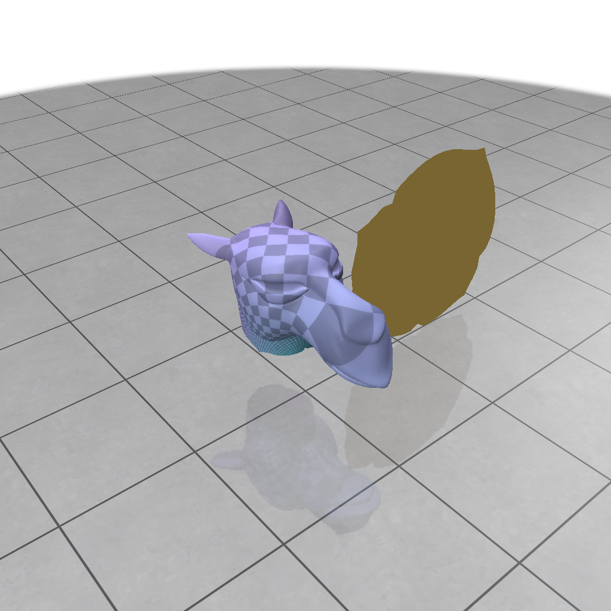

# Spectral Conformal Parametrization

Posted by: Theo Braune

In this TP we want to calculate through spectral optimization conformal parametrization of a mesh. 

You will need to complete the class methods in the class `ConformalParametrization` that you will find in `Conformal.cpp`. You can use the button in the GUI to see the conformal parameterization calculated by libigl.



A detailed description about the task and further information can be found in the [original publication](https://pages.saclay.inria.fr/mathieu.desbrun/pubs/MTAD08.pdf).

Given a mesh $M$, it will be your aim to find for every vertex $w\in M$ coordinates $(u_i,v_i)\in \mathbb{R}^2$ that form a conformal parameterization of the mesh. We will realize this by calculating minimizers of quadratic energies.

### Dirichlet Energy

In the first step of the task, you should calculate the Dirichlet energy of the mesh. To do that, you can use parts of the implementation of the Laplacian that you used already did in ```TD4``` to calculate the Dirichlet energy. 

**Note:** 
The Dirichlet energy is a quadratic energy that depends on the 2D coordinates of the parameterization of the mesh. It can therefore be realized through a self-adjoint, positive definite matrix of dimension ${2|V|\times 2|V|}.$

There are multiple ways to arrange the coordinates of the parameterization into the vector. For example, given a parameterization $P$ of the mesh $M$, 
$$\mathrm{P}(\mathrm{M}) = \begin{pmatrix} u_0& &v_0\\ u_1& &v_1\\ &\vdots& \\u_{|V|}& & v_{|V|}\end{pmatrix},$$
The Dirichlet energy of the parameterization can be realized through stacking up the parameterization into a one-dimensional vector and calculating
$$E_{\mathrm{Dirichlet}}(P) =(u_0,\ldots,u_{|V|},v_0\ldots,v_{|V|})\cdot \mathrm{Dirichlet}\begin{pmatrix}u_0\\u_1\\ \vdots\\u_{|V|}\\v_0 \\ v_1 \\ \vdots \\v_{|V|}\end{pmatrix}.$$
For a given parameterization $P(M)$, let $\tilde{P}$ be the flattened parameterization, represented by a ${|V|\times 2}$ matrix.

Complete the method ```compute_dirichlet``` and fill the sparse matrix ```Dirichlet```.

### Conformal Energy

With this resulting Dirichlet energy, we can now focus on minimizing the conformal energy to calculate a conformal parametrization.

In order to do this, note that the area of a discrete mesh can be computed through

$$\mathrm{Area}(P) = \sum_{e_{ij}\in \partial M}\frac{1}{2} (u_i v_j - u_j v_i),$$


From this, you should build in the method `compute_area` a sparse matrix $A$ such that:

$$
\mathrm{Area}(P) = \begin{pmatrix}u_1, v_1, u_2, v_2, \ldots, u_{|V|}, v_{|V|}\end{pmatrix} \cdot A \cdot \begin{pmatrix}u_1 \\ v_1 \\ u_2 \\ v_2 \\ \vdots \\ u_{|V|} \\ v_{|V|}\end{pmatrix}
$$

**Note:** The presented order to arrange coordinates (between $u_i$ and $v_i$) is not unique! If you used a different order of coordinates in the minimization of the Dirichlet energy, for example

$$\begin{pmatrix}u_1 & u_2 & \cdots & u_{{|V|}} & v_1 & v_2 & \cdots & v_{|V|}\end{pmatrix},$$

you need to be consistent with it.

With this matrix in place, complete the method `compute_conformal_energy` and build the matrix $\mathrm{Conformal}$ such that:

$$E_{\mathrm{Conformal}}(P) = \tilde{P}^T \cdot \mathrm{Conformal} \cdot \tilde{P}$$

For the details, please refer to the lecture's notes. As a remark, do not hesitate to recycle code from TD4.

**Task** You can implement a unit test that verifies your implementation of the area of a rectangle: create a 2D parameterization of a rectangular region of side length 6 and 8 and then flatten this vector according to the implementation and check if you are compatible with this:    
$$
\mathrm{Area}(P) = \tilde{P}^T \cdot \mathrm{Area} \cdot \tilde{P} = \begin{pmatrix}u_1, v_1, u_2, v_2, \ldots, u_{|V|}, v_{|V|}\end{pmatrix} \cdot A \cdot \begin{pmatrix}u_1 \\ v_1 \\ u_2 \\ v_2 \\ \vdots \\ u_{|V|} \\ v_{|V|}\end{pmatrix}= 48.
$$
Remember this should be an equality in double precison. This could look as follows
```cpp
TEST(AreaTest,Check_with_rectangle){

    //create Matrices V and F that have same mesh topology as your rectangle that you want to use for testing
    MatrixXd V;
    MatrixXi F;
    // create a V_rectangle that contains the point positions of your rectangle


    ConformalParameterization conf = ConformalParametrization(V, F);
    SpMat A = conf.Area;

    //double area =  v_rectangle_flat.transpose() * A * v_rectangle_flat;

    EXPECT_DOUBLE_EQ(area,48.);
}
```
### Spectral Minimization of the Conformal Energy.

Now, that the conformal energy is working, we are interested in finding minimizers of this energy, thus finding parameterizations where the Dirichlet energy and the area nearly match. A trivial solution to this is of couse given by $\tilde{P} = 0$, thus we have to constrain the minimization problem.  

You have seen in the course that there exist plenty of different ways to instriduce such a constraint. You can for instance pin two points of the parameterization and then solve for a minimizer of the conformal energy. This is what is happening when you call the function `igl::lscm`. 
```cpp
Eigen::VectorXi bnd,b(2,1);// create a vector that has two entries
igl::boundary_loop(F,bnd); //fetch all point indices from boundary
b(0) = bnd(0);// put the first fixed point on the 0th boundary point
b(1) = bnd(bnd.size()/2);// second fixed boundary point
Eigen::MatrixXd bc(2,2);
bc<<0,0,1,0; // force the first fixed point on (0,0), force the second point on (1,0)
//use the in-build Libigl parametrization to compare  
igl::lscm(V,F,b,bc,V_uv_libigl);
```
The downside of this approach is that your solution might close to a conformal map, but the choice of the constraint might have a strong influence on your result, as shown in the following figure.


Rather than forcing only two fixed boundary points, the spectral conformal parameterization technique (proposed in Mullen et al. 2008, that you will implement step by step in this TD), spreads the constraints over the whole mesh using a matrix B depending on all the boundary vertices (which has 1 on the diagonal position corresponding to boundary vertices and 0 everywhere else). This approach ensures that the optimal eigenvector maintains near-conformality for the quadratic form at the boundary, effectively reducing artifacts at internal vertices.

For our optimization problem, we ask thus for the following:

1) We want that our solution does not collapse. This can be expressed as the fact that the norm of the boundary vertices does not collapse to zero. You can thus build the matrix $B$ such that $\tilde{P}^T\ B\ \tilde{P}$ amounts to the sum of the squared norm boundary vertices. 
2) We want that our solution is centered around the origin. This means that $\frac{1}{|\partial P|}\sum_{v\in \partial P}v = 0.$ In other words, if you have a vector $e\in \mathbb{R}^{2|V|}$ that is 1 for all boundary vertices and zero everywhere else, you want that $P^T\cdot B\cdot e = 0$.
3) The conformal energy should be minimized given these constrains mentioned above!

All taken together, this leads to the optimization problem 
$$\mathrm{min}_{\tilde{P}^T B \tilde{P}=1,\  \tilde{P}\cdot B\cdot e = 0 } \tilde{P}\cdot\mathrm{Conformal}\cdot\tilde{P}$$

The solution to this problem is given by the eigenvector to the smallest non-zero eigenvalue of the generalized Eigenvector problem
$$\mathrm{Conformal}\ \cdot \tilde{P} =\lambda \left(B - \frac{1}{|\partial P| }(e^T B^T B e)\right)\ \tilde{P}$$


This vector can be found through a so-called, power iteration, described in the following. 
### Power Iteration for generalized Eigenvector Problems
The spectral theorem in linear algebra states that for a self adjoint, positive definite matrix $A\in \mathbb{R}^{n\times n}$, there exists an orthonormal basis of eigenvectors of $A$, $\mathcal{B}$ such that the representing matrix in this basis is a diagonal matrix and all eigenvalues are positive. Thus, the routine 
```cpp
u = random_vector;
while(objective_not_achieved)
    u = A*u;
    u.normalize();   // to avoid an uncontrolled growth
```  
will bring us after some iterations to the eigenvector of the largest eigenvalue (think in 3D for example about a sphere that becomes stretched along its coordinate axes though applying $A$. ).

However, we are interested in the eigenvector to the smallest eigenvalue. To do that note that if $\lambda$ is an eigenvalue to the eigenvector $e$, $\frac{1}{\lambda}$ is an eigenvalue of $A^{-1}$ to the eigenvector $e$ (clear?). We can thus instead find the eigenvector to the largest eigenvalue of $A^{-1}$. 

However in our case we should under **NO** circumstances compute the inverse of the conformal enery matrix. Even though the conformal energy matrix is sparse, its inverse may not be sparse at all. Think for example about the laplacian matrix. It is a local differential operator, thus as you have seen its matrix is very sparse. However to invert it, we will need to do some kind of global integration, something that is in terms of matrix language not sparse at all. 

Instead of 
```cpp
u = random_vector;
while(objective_not_achieved)
    u = A*u;
    u.normalize();  // to avoid an uncontrolled growth
```  
you should solve in every iteration a sparse linear system and change the routine to
```cpp
u = random_vector;
while(objective_not_achieved):
    v = solve(A,u)
    u = v/norm(u)
```
To find the eigenvector to the smallest non-zero eigenvalue of the generalized eigenvalue problem
$$A x=\lambda Bx$$
you need to adapt the routine only slightly. 
```cpp
u = random_vector;
while(objective_not_achieved):
    w = B*u;
    v = solve(A,w);
    u = v/norm(u);
```
You might think that it is extremely costly and slow to solve in every step a large sparse linear system. Fortunately you can accelerate this routine. Given a symmetric positive definite matrix $A$, there exists a triangular matrix $L$ such that $A = L\ L^T$. Once you have calculated the a linear system $Ax =b$ can be solved very efficiently at little cost (why?).

Eigen has as an in build method the sparse cholesky factorization; the details can be found [here](https://eigen.tuxfamily.org/dox/group__SparseCholesky__Module.html). Thus the overall code routine could look as follows

```cpp
u = random_vector;
Eigen::CholeskySolver cholesky_solver(A); //here eigen internally computes A = LL^T (or L D L^T)
while(objective_not_achieved):
    w = B*u;
    v = cholesky_solver.solve(w); // using the computed pre-factorization the system can be solved very rapidly
    u = v/norm(v);

```

Complete the method ```minimize_energy_spectral()``` and calculate the conformal parameterizations. 

**Remarks:**

   1) The factorization of the conformal energy matrix may be numerically instable, one thing that may help is to add a *regularizer*, meaning to use $\varepsilon \approx 10^{-8}$ to update the conformal energy matrix to 
   $$\mathrm{Conformal} \leftarrow \mathrm{Conformal} + \varepsilon \ \mathrm{Id}$$
   2) In general if you get stuck with the sparse Cholesky solver, try another one (for instance a conjugate gradient). It may not be the ideal choice for the problem, but should tell you if the rest went well
   


**Bonus:** The calculation of mesh parameterizations is very useful to do texture mapping on surfaces. Therefore, be creative and design a texture to decorate a surface mesh; map it with your parameterization on the original mesh :) You can use the methods from libigl to load an image into your program. Then, convert it into `SurfaceTextureColorQuantity` for polyscope using the coordinates of the parameterization that you just calculated.


